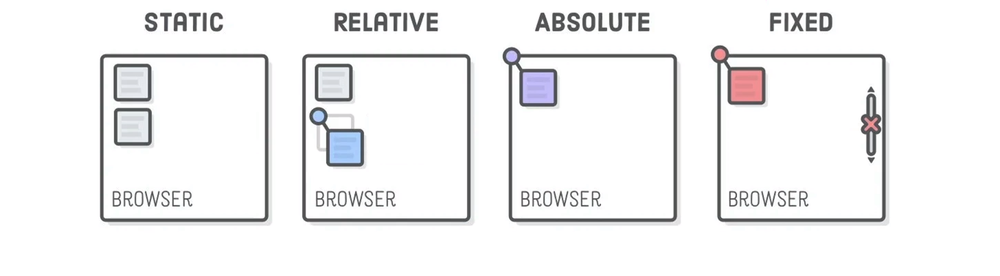

# CSS Properties

## CSS Box model
Each element is contained in a box.
Different properties will modify box aspect and size.

- Height and Width: Will change the size of the inner box, its content space.
- Border : Border can be added and customized. It doesn not affect the inside box size;
- Padding: Space between content and border
- Margin: Space between the border and any other content in the wabpage

## Ways to pass values to padding, margin and border-width properties

- 1 value for all box sides.
```css
/* Top - Right - Bottom - Left */
div{
    padding:0px
}
```
- 4 values for each sides of the box. Clockwise, starting from top.
```css
/* Top - Right - Bottom - Left */
div{
    padding:0px 0px 0px 5px
}
```
- 2 values for opposites sides of the box.
```css
/* Top+Bottom  - Right+Left */
div{
    padding:0px 5px
}
```
## CSS positioning


### Static
HTML default flow: elements are placed at the bottom of the previous element.

### Relative
Position will be relative to the static (default) position.

### Absolute
Nearest positionned ancestor, or else top left corner of the webpage.

### Fixed
Position relative to the top left corner of the browser. It will follow when scrolling.

### Z-index
This value determines which element appear on top of other element (on z-axis).

Value goes from -infinity to +100. The higher the number, the upper it is on the z-axis.

By default, z-index is set to 0.

If position is set to 'absolute', then the element is put by default on an upper layer. So even with an equal number, 'absolute' appears upper.
